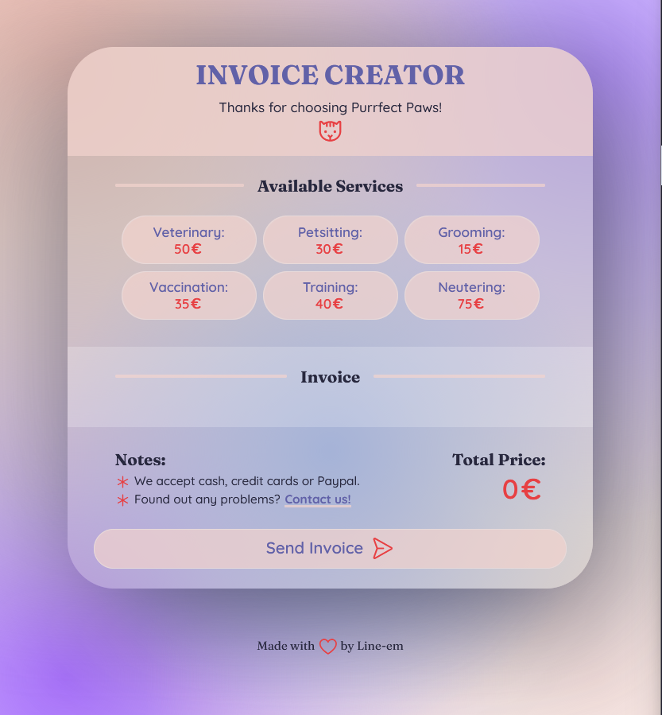
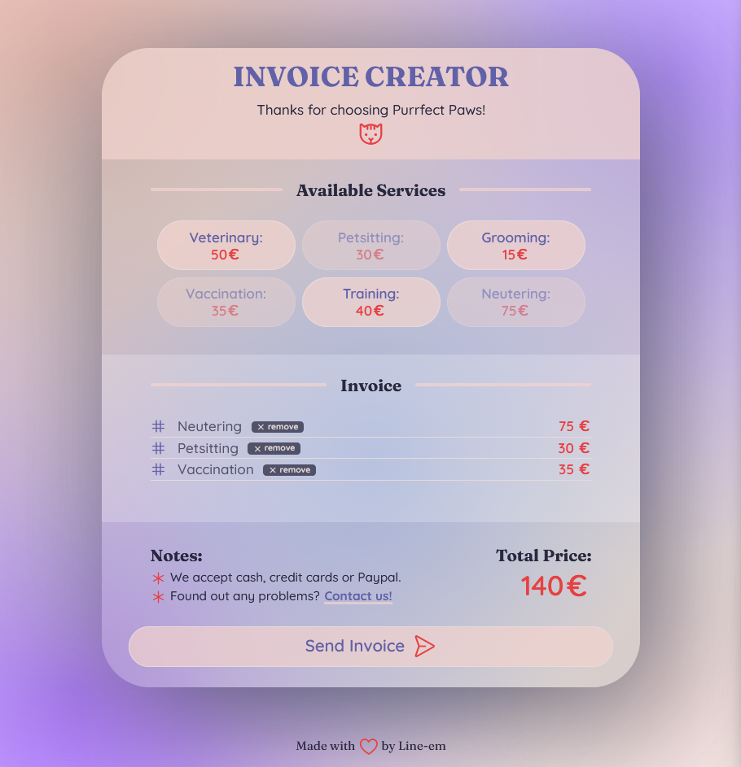

# Invoice Creator: Purrfect Paws

Solo project made at the Scrimba Javascript Course. 🎉
It is coded with vanilla JS and is fully responsive (I hope!). It is themed after a made-up **veterinary clinic**, Purrfect Paws. All the prices are arbitrary.

If you encounter any problems, or have any feedback for me, I'd love to hear about it! Thank you! 😊

[**Check it live here! ✨**](https://line-em.github.io/invoice-creator-purrfect-paws/)

---

## Overview

**This project is finally complete!**

The most challenging aspect of this project so far was including the **remove buttons** and making it properly functional in manipulating the array. I'm happy to say that it is now working as intended! 🥳✨

Of course, if you do find any bugs, errors, or any suggestions at all, please let me know! I'd love to hear from you! 😊

## To-Do

-   [x] Include a functional Remove button
-   [ ] Generate a some feedback after clicling on Send Invoice.

## Changelog

-   1.0 - Initial commit.
-   2.0 - Added the Remove button.
